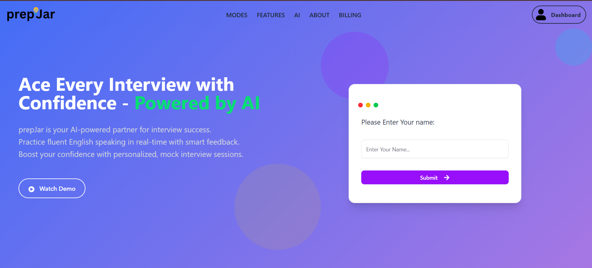
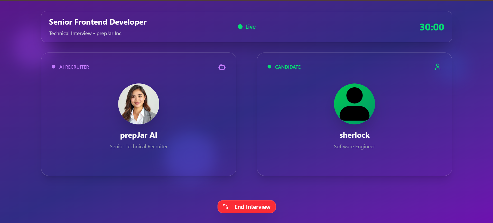
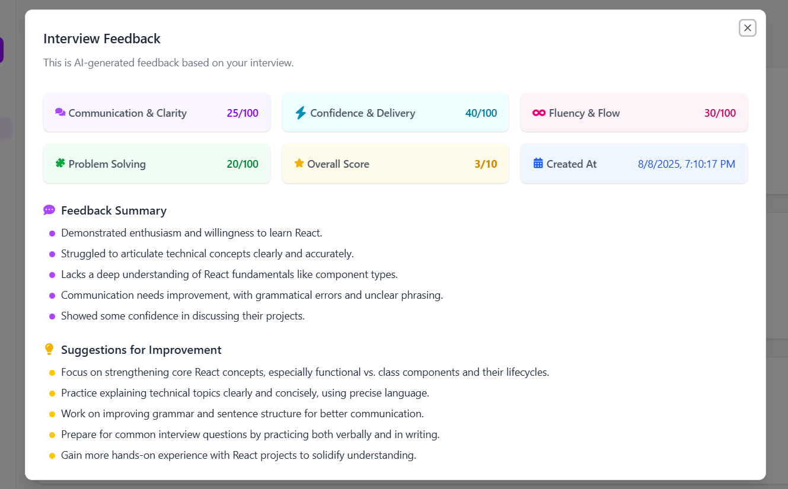

# 🥇 PrepJar – Master Every Concept with AI

[](https://prepjarai.vercel.app)
[](LICENSE)


---

## 🚀 Overview

**PrepJar** is an **AI-powered interview preparation platform** that brings **realistic, voice-interactive mock interviews** right to your browser.  
It delivers **instant feedback**, **custom improvement tips**, and **detailed scoring** across multiple skills — plus an **overall rating** — to help you track progress, pinpoint weaknesses, and **boost confidence** before the real interview.

---

## ✨ Features

| Feature                               | Description                                            |
| ------------------------------------- | ------------------------------------------------------ |
| 🤖 **AI Question Generation**         | Generates technical & behavioral questions dynamically |
| 🎙 **Voice Interaction**               | Real-time mock interviews using Vapi SDK               |
| 📊 **Analytics Dashboard**            | View scores, strengths, and weaknesses                 |
| 💡 **Instant Feedback & Suggestions** | Get improvement tips from AI                           |
| 🎯 **Skill Gap Analysis**             | Identifies specific areas to work on                   |
| 🛠 **Custom Interview Design**         | Choose topics, difficulty & style                      |
| 📈 **Progress Tracking**              | Track performance over time                            |

---

## 🛠 Tech Stack

**Frontend**  
<a href="https://nextjs.org/"></a>
<a href="https://redux.js.org/"></a>
<a href="https://tailwindcss.com/"></a>
<a href="https://www.framer.com/motion/"></a>
<a href="https://ui.shadcn.com/"></a>
<a href="https://axios-http.com/"></a>
<a href="https://vapi.ai/"></a>

**Backend**  
<a href="https://nodejs.org/"></a>
<a href="https://nextjs.org/docs/app"></a>
<a href="https://authjs.dev/"></a>

**AI & APIs**  
<a href="https://www.langchain.com/"></a>
<a href="https://deepmind.google/"></a>

**Database**  
<a href="https://www.mongodb.com/"></a>
<a href="https://mongoosejs.com/"></a>

**Deployment**  
<a href="https://vercel.com/"></a>

---

## 📸 Screenshots

| Home Page          | Interview Screen             | Feedback Screen          |
| ------------------ | ---------------------------- | ---------------------------- |
|  |  |  |

---

## 📦 Installation

### Prerequisites

-   **Node.js** ≥ 20.0.0
-   **npm** ≥ 10.0.0
-   Environment variables:
    -   `VAPI_API_KEY`
    -   `GEMINI_API_KEY`
    -   `GEMINI_API_SECRET`
    -   `MONGODB_URI`
    -   `AUTH_SECRET`

## 🚀 Getting Started

Start developing locally in just a few steps.

### Step 1: Clone the Repository

Fork this repository, then clone it to your local machine:

```bash
git clone https://github.com/amir-razvi-08/prepJar.git
cd prepjar
```

### Step 2: Install Dependencies

Install the required Node.js packages:

```bash
npm install
```

### Step 3: Configure Environment Variables

To run the server you will also need to provide the .env.local variables:

-   create a new file .env in the root
-   open **env.example**
-   copy the contents and paste it to the .env.local with valid keys

### Run the development server

```bash
npm run dev
```

## 🧪 Usage

1. **Sign up / Log in**
2. **Select interview type, difficulty, and topics**
3. **Speak to the AI interviewer** via realistic voice interaction
4. **Receive detailed feedback and scores**
5. **Track your progress** with analytics over time

---

## 🙏 Acknowledgments

Special thanks to the technologies and tools that made PrepJar possible:

-   [Next.js](https://nextjs.org/) – React framework
-   [Redux](https://redux.js.org/) – State management
-   [TailwindCSS](https://tailwindcss.com/) – Utility-first styling
-   [Framer Motion](https://www.framer.com/motion/) – Smooth animations
-   [shadcn/ui](https://ui.shadcn.com/) – Modern UI components
-   [Axios](https://axios-http.com/) – API requests
-   [Vapi SDK](https://vapi.ai/) – Voice interaction engine
-   [LangChain](https://www.langchain.com/) – AI workflow orchestration
-   [Google Gemini](https://deepmind.google/) – Generative AI model
-   [Auth.js](https://authjs.dev/) – Authentication
-   [MongoDB](https://www.mongodb.com/) & [Mongoose](https://mongoosejs.com/) – Database and ODM
-   [Vercel](https://vercel.com/) – Deployment platform

---

## 📜 License

This project is licensed under the **MIT License** – see the [LICENSE](LICENSE) file for details.

---

## 📧 Contact

[](#)  
[](mailto:amirrazvi8@gmail.com)  
[](https://github.com/amir-razvi-08)  
[](https://www.linkedin.com/in/amirrazvi8)
